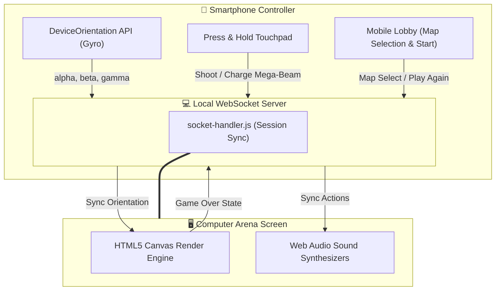

# 🌌 Motion Shooter Arena

<div align="center">



<br>


<p align="center">
  A premium, interactive, dual-device arcade shooter that transforms your smartphone into a motion-sensing weapon!
</p>

### [🎮 Desktop Arena Client](file:///Users/venkatesh/Documents/Projects/Shooter/game/index.html) • [📱 Mobile Controller Client](file:///Users/venkatesh/Documents/Projects/Shooter/controller/index.html)

</div>

---

## ⚡ How It Works

Motion Shooter Arena coordinates desktop screens and mobile sensors via low-latency WebSockets:



---

## 🚀 Step-by-Step Setup

### 1. Prerequisites
- **Node.js** (v16 or higher recommended)
- Your computer and smartphone **MUST be on the same Wi-Fi network**.

### 2. Install Project Dependencies
Clone the repository and run install:
```bash
git clone https://github.com/venkatesh-0007/Motion_Shooter.git
cd Motion_Shooter
npm install
```

### 3. Launch Server
Start the development server:
```bash
npm start
```
The console will boot the HTTP/WS server and output the local LAN pairing URLs and a terminal QR Code.

### 4. Open Interfaces
1. **Open the Arena (Computer):** Go to `http://localhost:3001/game` (or the LAN IP printed in terminal, e.g. `http://192.168.1.15:3001/game`).
2. **Connect the Blaster (Phone):** Scan the pairing QR code displayed on the desktop lobby screen or open `http://192.168.1.15:3001/controller` on your smartphone.

---

## 🔒 Enabling Gyro Sensor on Local IP (Critical)

Modern browsers restrict mobile sensors to secure contexts (`HTTPS`). Since this runs on local network (`HTTP`), you must authorize your mobile browser to trust your local computer server:

<details>
<summary><b>🌐 Setup Guide for Google Chrome (Android/iOS)</b></summary>
<br>

1. Open Chrome on your phone and navigate to:
   `chrome://flags/#unsafely-treat-insecure-origin-as-secure`
2. **Enable** the flag.
3. Paste the LAN IP origin of your computer (e.g. `http://192.168.1.15:3001`) into the text box.
4. Tap **Relaunch** at the bottom of Chrome.
</details>

<details>
<summary><b>🍎 Setup Guide for Apple Safari (iOS)</b></summary>
<br>

1. Go to iOS **Settings** > **Safari**.
2. Scroll down to **Privacy & Security** and ensure **Motion & Orientation Access** is turned **ON**.
3. Accept the sensor request popups when loading the controller page.
</details>

---

## 🎮 Battle Arenas (Maps)

Choose your battleground directly from the mobile lobby. The computer screen updates dynamically to match:

### 🏜️ Map 1: Cyber Canyon
* **Aesthetic:** High-contrast neon scrolling wireframe grids.
* **Foes:** Walk-animated combat robots heading straight for your visor.
* **Combat:** Hitting the head registers a one-shot headshot. Hitting the body requires 2 hits.
* **Challenge:** Move fast before they pass the defense line!

### 🏢 Map 2: Sniper Apartment
* **Aesthetic:** Circular watch sniper scope lens mask overlay with crosshair markings.
* **Boss Introduction:** Features a target face card screen (Target #1: bald boss with mustache and sunglasses) requiring a touch trigger to launch.
* **Foes:** Popping window targets sliding up and down across a 3x3 apartment brick wall layout.
* **Combat:** Instant critical headshots if aimed at the top window region. Requires 2 body hits to destroy the targets (flashes red when damaged).

---

## ⚔️ Futuristic Weapon Loadout

Select your gun from the mobile controller dashboard. Active buttons display custom themed color glows:

| Weapon | Fire Mode | Rate of Fire | Damage | 特 Special Ability (Charge Beam) | Active Theme |
| :--- | :--- | :--- | :--- | :--- | :--- |
| **Plasma Disrupter** | Semi-Auto | Medium | `50` | **Yes** (Hold to charge Mega-Beam) | Cyan Glow 🔵 |
| **Laser Repeater** | Auto-Fire | Extremely High | `25` | *No* (Continuous fire without charging) | Pink Glow 🔴 |
| **Quantum Railgun** | Semi-Auto | Low (Rail Recharge) | `100` | **Yes** (Hold to charge Mega-Beam) | Green Glow 🟢 |

---

## 📱 Mobile Controller Gestures & Interactions

This game implements a **Mobile-First** layout—no laptop keyboard or mouse input required!

* **Aiming:** Physically tilt, turn, and point your phone to steer the crosshair.
* **Shooting:** Tap the touchpad. Standard shots trigger a crisp **15ms haptic pulse vibration**.
* **Automatic Fire (Laser):** Press and hold the touchpad to unleash continuous laser fire. Auto-charging is disabled for this gun, preventing timing interference.
* **Mega-Beam (Plasma/Railgun):** Long-press and hold the touchpad. The phone screen will fill the neon charge bar. Release to fire a 160px blast radius explosion that obliterates multiple targets.
* **Recenter (Calibration):** Tap the physical **Recenter** button at the bottom of the controller screen to reset orientation angles.
* **Lobby Start / Play Again / Return to Lobby:**
  - Game lobbies and Game Over menus display these options directly on the head mobile controller.
  - Pressing **Play Again** resets scores and restarts the game round.
  - Pressing **Return to Lobby** transitions the game client and controller overlays back to the lobby state.
